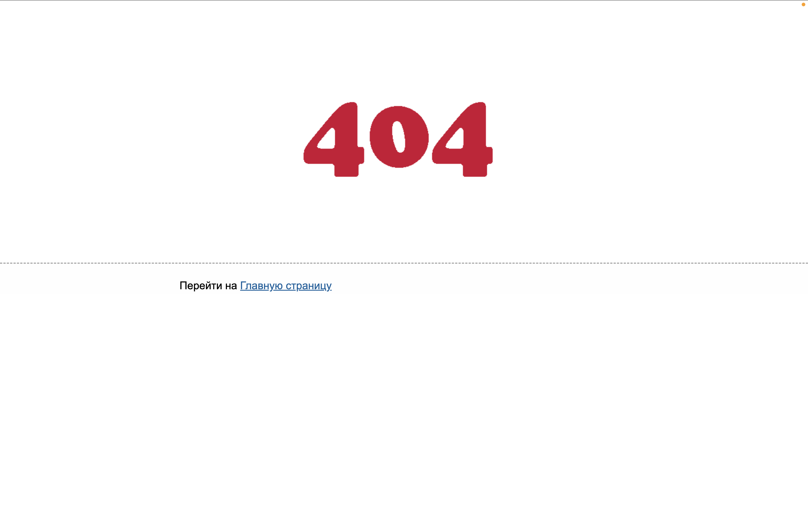
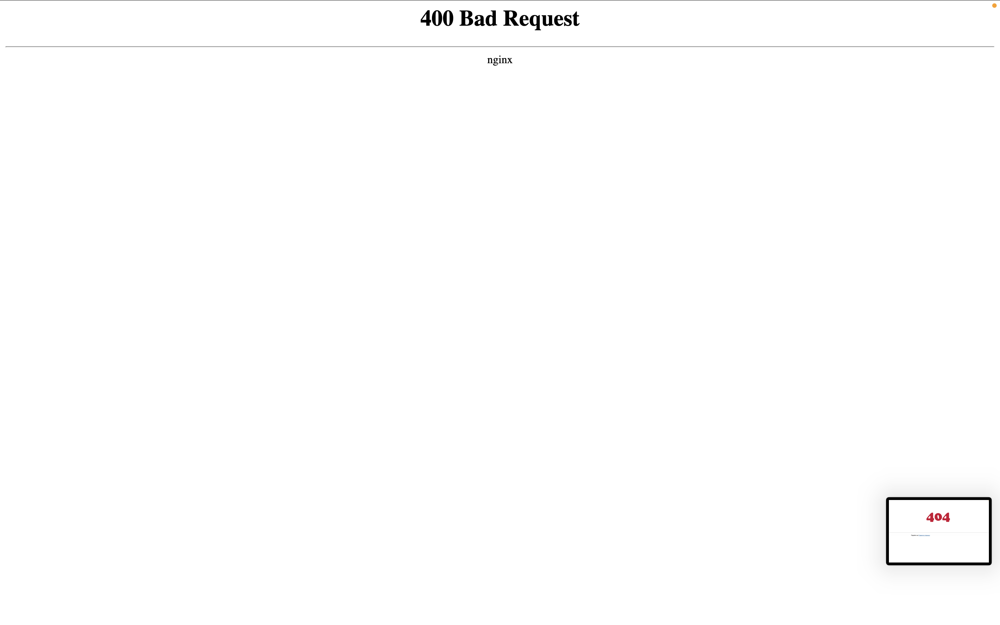
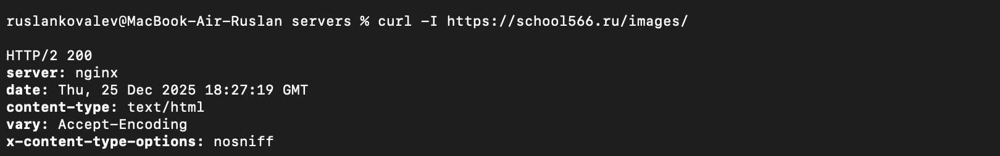
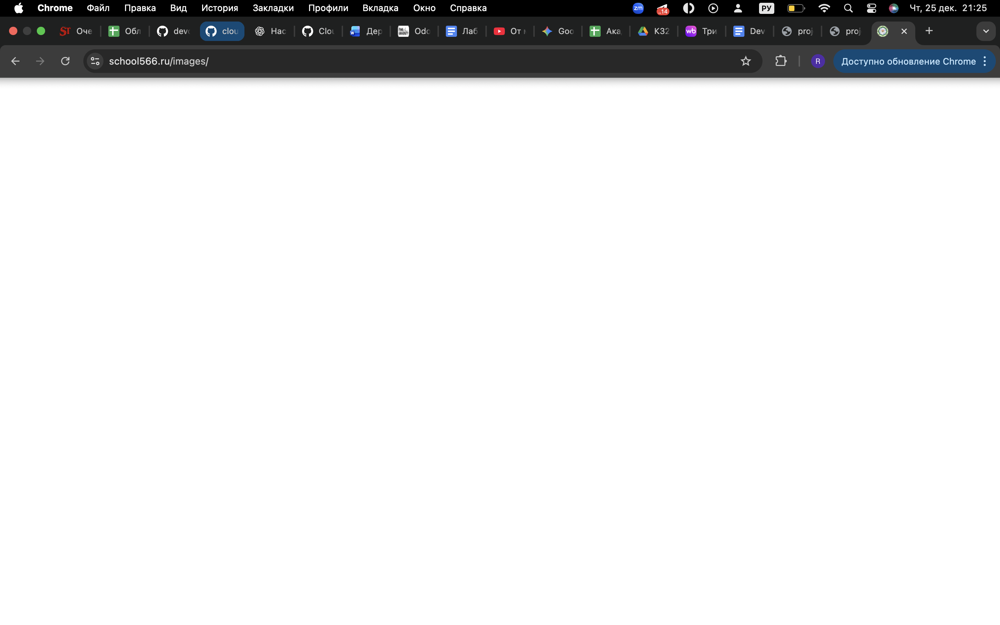
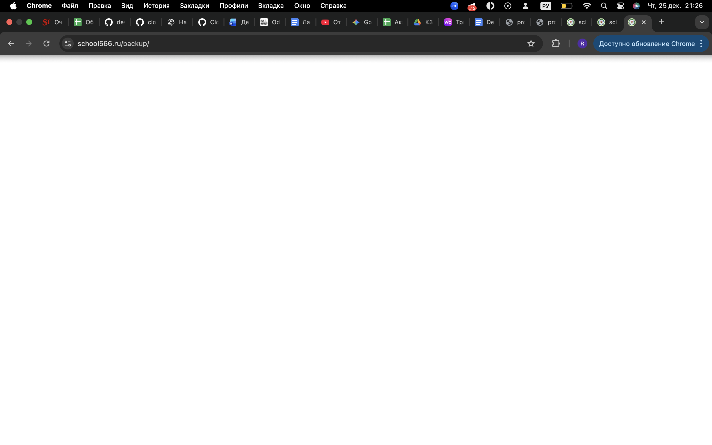
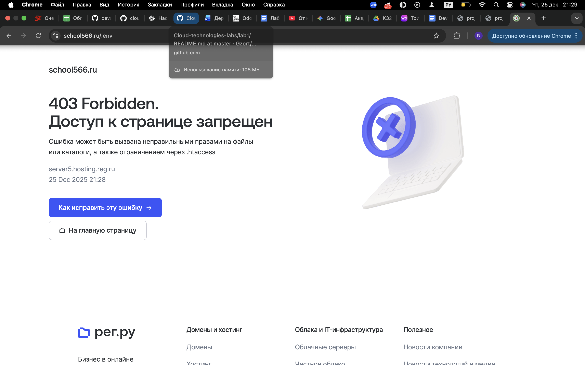
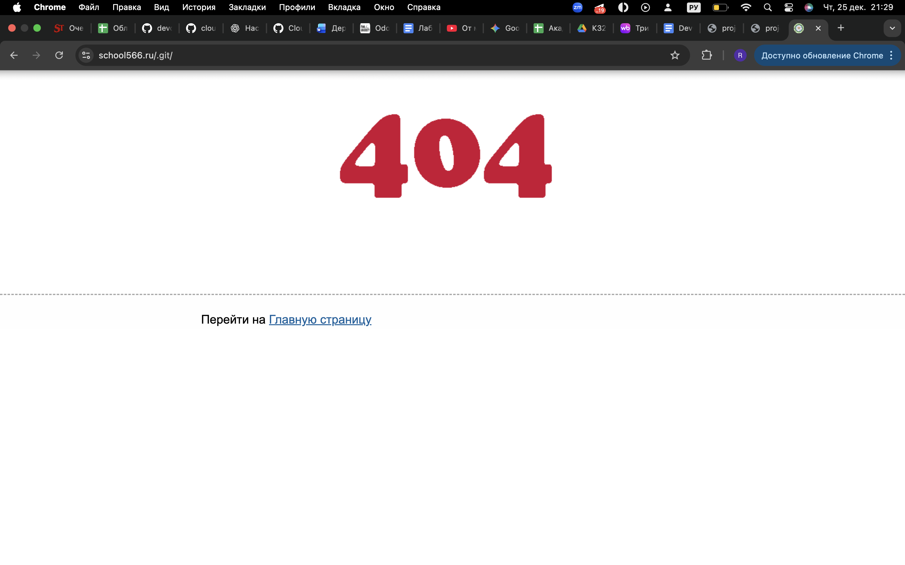

# Лабораторная работа №2  

**Выполнил:** Ковалев Руслан Бабекович

## Объект тестирования

В качестве объекта тестирования был выбран сайт школы моего друга: https://school566.ru/

Тестирование проводилось **пассивно**, исключительно с использованием
GET-запросиков, без нагрузки на сервер, без подбора паролей и без попыток
изменения данных, :).

## Проверка 1 - Path Traversal

### Описание

Проверялась возможность выхода за пределы web-root сервера с использованием
последовательностей `../` и их URL-кодированных вариантов.

### Примеры запросов

``/../../../../etc/passwd``
``/..%2F..%2F..%2Fetc/passwd``
``/%2e%2e/%2e%2e/etc/passwd``

### Результат

Сервер возвращал ответы:

- `404 Not Found`
- `400 Bad Request`

### Вывод

Попытки path traversal были корректно заблокированы.
Доступ к файлам за пределами web-root невозможен.
Уязвимость не обнаружена.
Примеры - 

## Проверка 2 — Перебор директорий (Directory Enumeration)

### Описание

Проверялась доступность стандартных и потенциально служебных директорий,
которые могут быть забыты при настройке сервера.

### Проверенные пути
Было проверено много директорий
Относитильеный успех у /images/
/backup/
При обращении к директории `/images/` сервер возвращал ответ:

При этом в браузере отображалась пустая страница.

### Вывод

Ответ `200 OK` указывает на существование директории и её обработку сервером.
Несмотря на отсутствие отображаемого контента, данный факт может раскрывать
структуру приложения и является потенциальным конфигурационным риском.

## Проверка 3 — Доступ к служебным файлам и директориям

### Описание

Проверялась возможность доступа к служебным файлам и каталогам,
которые не должны быть доступны пользователю.

### Проверенные пути
``/.env``
``/.git/``
``/.git/config``
``/config.php~``

### Результат

Во всех случаях сервер возвращал ответы:

- `403 Forbidden`
- `404 Not Found`

### Вывод

Доступ к служебным файлам и директориям корректно ограничен.
Уязвимость не обнаружена.

## Итог

В рамках лабораторной работы были проверены три различных класса уязвимостей:

1. Path traversal (обход ограничений файловой системы)
2. Перебор директорий и раскрытие структуры сайта
3. Доступ к служебным файлам и директориям

Критических уязвимостей обнаружено не было.
Отдельные особенности конфигурации (ответ `200 OK` для служебных директорий)
могут рассматриваться как потенциальный риск (ботики).

