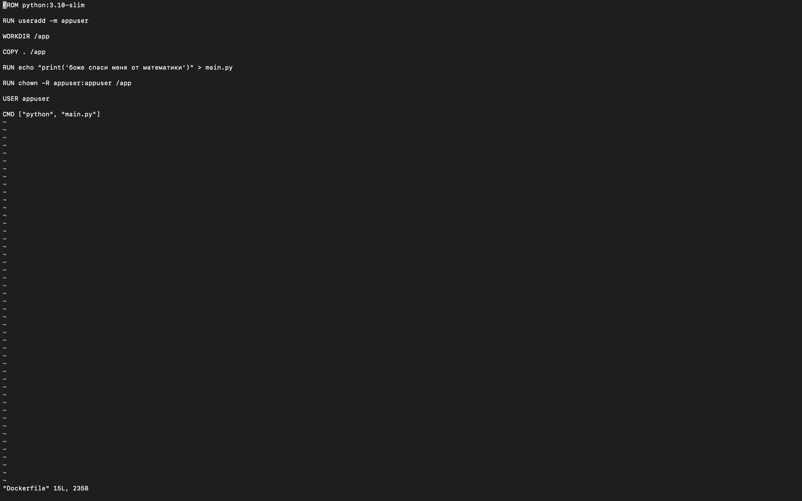
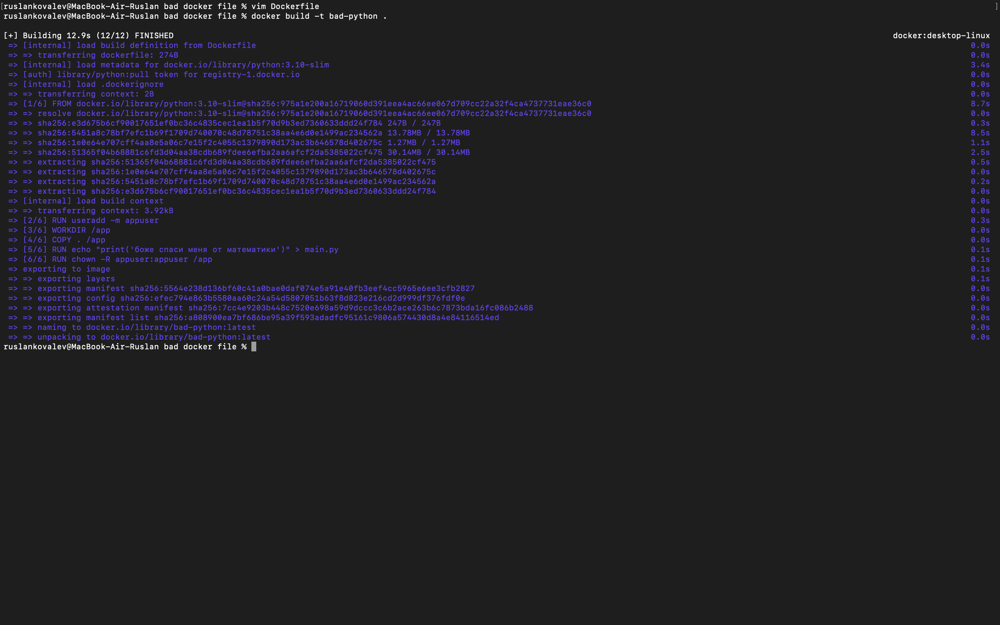

Лаба №2

Перед выполнением посмотрел гайдики по докеру

В моем докер файле были использованны следущие practices:
Bad - Использование :latest (FROM python:latest)
Установка ненужных пакетов (vim, curl, git, gcc, make, tree, htop)
Хранение токена GitHub через ENV (ENV GITHUB_TOKEN=) докер даже сам ругает
Клонирование репозитория внутри Dockerfile (RUN git clone)
Запуск контейнера от root (USER root)

Получилось вот такое - 

Забилдил - 

И после рана словил ошибку -

Спустя пять минут наконец-то понял что нужно поставить одиночные кавычки :)

Теперь починим гадости, которые я написал 

Добрый код(позитивный)

Добрый билд

Добрый ран

Вообщем исправил -
FROM python:latest -> FROM python:3.10-slim
теперь фиксированная версия Python

Удалил установку ненужных пакетов (vim, curl и т.д.)
образ стал меньше, сборка быстрее

Удалил хранение GitHub-токена (ENV GITHUB_TOKEN=)
токен не попадает в образ и не компрометируется ( $$$ )

Удалил git clone из Dockerfile
теперь код копируется локально (COPY . /app)

Создал отдельного пользователя appuser вместо root
повысили безопасность контейнера ( в умные вещи тоже могу 😎 )

Добавил RUN chown -R appuser:appuser /app
чтобы пользователь имел права на рабочую директорию ( 😎 ) 

Добавил USER appuser
контейнер теперь запускается под обычным пользователем, не root ( 😎 )

Как можно сделать гадости даже с хорошим докер файлом 
1.Запуск контейнера от root
Даже если докер файл настроен безопасно, можно случайно запустить контейнер от root.
Это опасно: контейнер может менять системные файлы или удалить что то важное.

2.Доступ к чужим папкам на компьютере
Если при запуске дать контейнеру доступ к большим папкам на хосте (-v /home/user:/app), он сможет менять или удалять файлы.
Лучше давать доступ только к отдельной папке для данных контейнера. ( это на стаковерфлоу написано )

Выводы
Сборка стала более стабильной, безопасной, быстрее и легче.
И я знаю, что не замазл токен в билдах. Он уже отключен ( 😎 )

